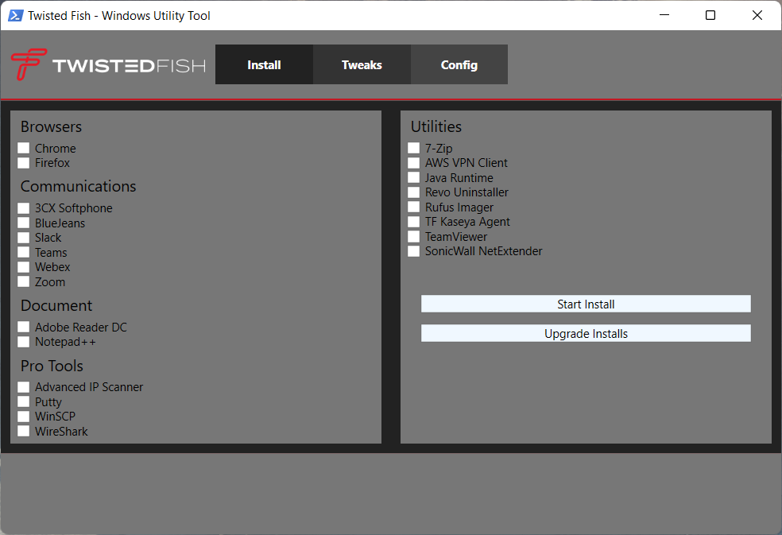

# Twisted Fish - Windows Utility Tool

This Utility is meant to streamline *installs*, debloat with *tweaks*




Requires you to launch PowerShell or Windows Terminal As ADMINISTRATOR! 

The recommended way is to right click on the start menu and select (PowerShell As Admin *Windows 10* - Windows Terminal As Admin *Windows 11*)

Launch Command:

```
iwr -useb https://bit.ly/TFwut | iex
```

```
irm https://bit.ly/TFwut | iex
```
If you are having TLS 1.2 Issues or You cannot find or resolve `bit.ly/TFwut` then run with the following command:
```
[Net.ServicePointManager]::SecurityProtocol=[Net.SecurityProtocolType]::Tls12;iex(New-Object Net.WebClient).DownloadString('https://raw.githubusercontent.com/Sp5rky/wut/main/wut.ps1')
```

## Overview

- Install
  - Installs all selected programs
  - Has Upgrade ALL existing programs button
- Tweaks
  - Optimizes windows and reduces running processes
  - Has recommended settings for each type of system
